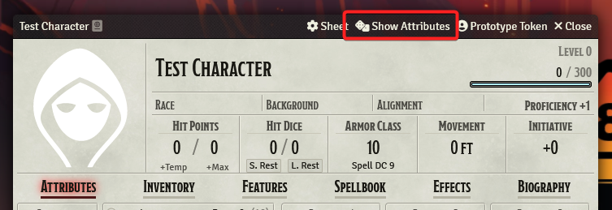
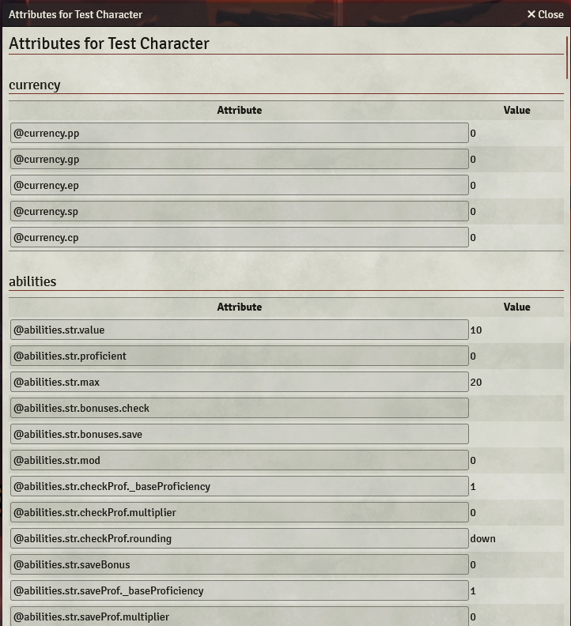

# Actor Attribute List

Lists all Attributes of an Actor Sheet for use in Descriptions.

Inspired by [Actor Attribute Lists](https://github.com/relick/FoundryVTT-Actor-Attribute-Lists) Module.

## Installation

1. Open the Add-on Modules tab in the Configuration and Setup dialog.
2. Click Install Module and search for "Actor Attribute List", or use the following manifest URL: `https://raw.githubusercontent.com/mybigfriendjo/actor-attribute-list/main/module.json`
3. Install the module and activate it for your World using the checkbox in the 'Manage Modules' Dialog.

## Usage

The module adds a new Header Button to the Actor Sheet called "Show Attributes".

Clicking it opens a new Window with all Attributes of the Actor Sheet in a table. The table is divided into sections for each type of attribute. Filtering is possible by typing into the search bar at the top of the window. It searches both the Attribute Name and the Attribute Value.

From there you can copy the Attribute Names for use in Text and Descriptions.

Implemented Systems are below. Adding additional Systems can be done depending on respective complexity.

If you want a system added, an optional but very helpful step would be confirming that the descriptions of a system are actually enriched to use attributes in the first place. You can do so in the respective game channel in foundry's discord and it might save you the time to open an Issue. [FoundryVTT Discord](https://discord.gg/foundryvtt)

If you get confirmation or are unsure, feel free to open an Issue and i will look into it and add the system if and when i can.

## Added Systems

| id    | System                          | Info |
|-------|---------------------------------| --- |
| dcc   | Dungeon Crawl Classics          | Attributes are taken from actor.getRollData() Contribution by [@cyface](https://github.com/cyface) |
| dnd5e | Dungeons & Dragons 5th Edition  | Attributes are taken from actor.getRollData() |
| pf2e  | Pathfinder 2nd Edition          | Attributes are taken from the actor.system collection. Not all Values can be used as-is. Please refer to the [pf2e Style-Guide](https://github.com/foundryvtt/pf2e/wiki/Style-Guide#inline-roll-links) for more information. |
| swade | Savage Worlds Adventure Edition | Attributes are taken from actor.getRollData() |

## Systems without Editor Enrichment

The following Systems have been added but they do not have the necessary Editor Enrichment to use Attributes in Descriptions.

| id  | System                | Info                                          |
| --- | --------------------- | --------------------------------------------- |
| ose | Old School Essentials | Attributes are taken from actor.getRollData() |
| wwn | Worlds Without Number | Attributes are taken from actor.getRollData() |
